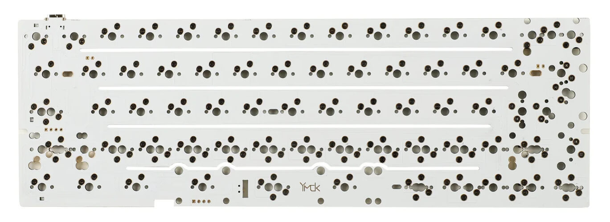
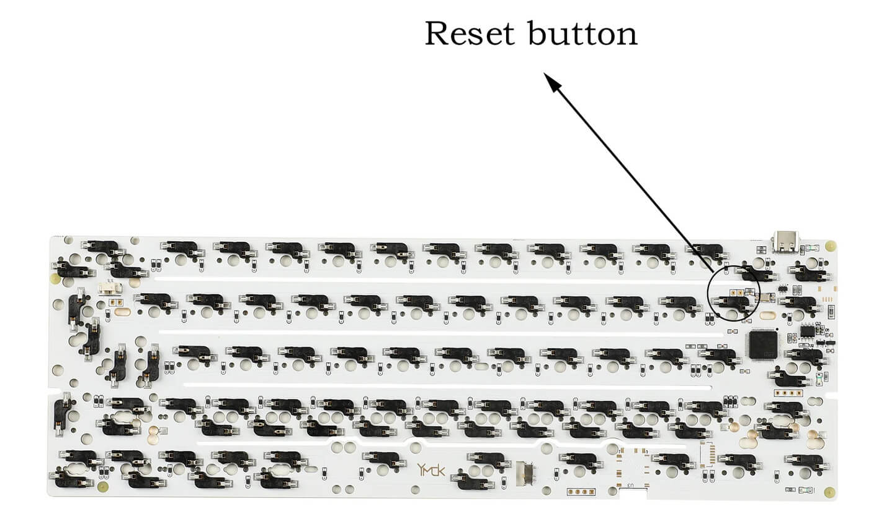

# YMDK DK61 firmware

Here is some source code to make the [YMDK DK61 PCB](https://ymdkey.com/products/ymdk-dk61-64-gh60-wired-hot-swappable-60-pcb-support-iso-ansi-fully-programmable-via-vial) work with [current QMK firmware](https://github.com/qmk/qmk_firmware/).

It's based on the source files shared by YMDK when contacting them, available in this repo in a archive file for reference. Those source files don't work as is though, as they seem to follow old QMK conventions.

Filenames imply the DKKB DK6064 is the same PCB so this should work with it too.

## :warning: Disclaimer

Sorry I'm not making any pull request to the QMK repository as I don't _really_ know what I'm doing here. I just tinkered with the source files a bit, it works for me, and that's pretty much it.

## How-to

- place this in your qmk_firmware/keyboards folder, for example `qmk_firmware/keyboards/dk61`,
- change the `keymap.c` according to your physical layout[*]
- compile and flash like any other QMK keyboard.

[*]: The default keymap lists all the sockets available on the board, already exposing some as `KC_NO` when it's physically impossible to have them with the other example keys set. For example the bottom row in the file shows the config for classic ANSI bottom row mods + split splacebar.  
So you'll certainly need to do some trial and error and flash a few times before finding the right definition for your actual layout.

If you want to do a pull request to expose all the possible layouts to ease up the config, you are very welcome :)

### Bootloader

One noticeable thing: I had a tiny bit of trouble going into bootloader mode with the PCB. If trying all the [things mentioned in the QMK docs](https://docs.qmk.fm/newbs_flashing#put-your-keyboard-into-dfu-bootloader-mode) doesn't work, try this:

- if you're on Linux, you might actually successfully go into bootloader mode without noticing, because it might not mount automatically. For me, after successfully going into bootloader mode, a USB drive was listed in my file manager and I had to click on it so that it gets mounted and be correctly seen when using `qmk flash`.
- try the shortcut defined in the original source files to go into bootloader (Fn + Esc, with Fn being a key in the right of the bottom row)
- if it really doesn't go into bootloader mode, short the two pads on the back of the PCB that are above the 'Q' key switch, when plugging in the keyboard.

